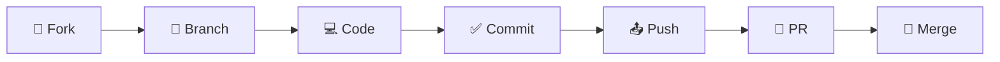
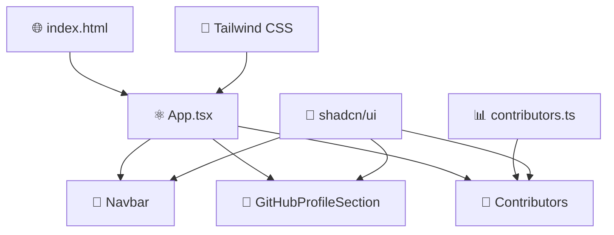
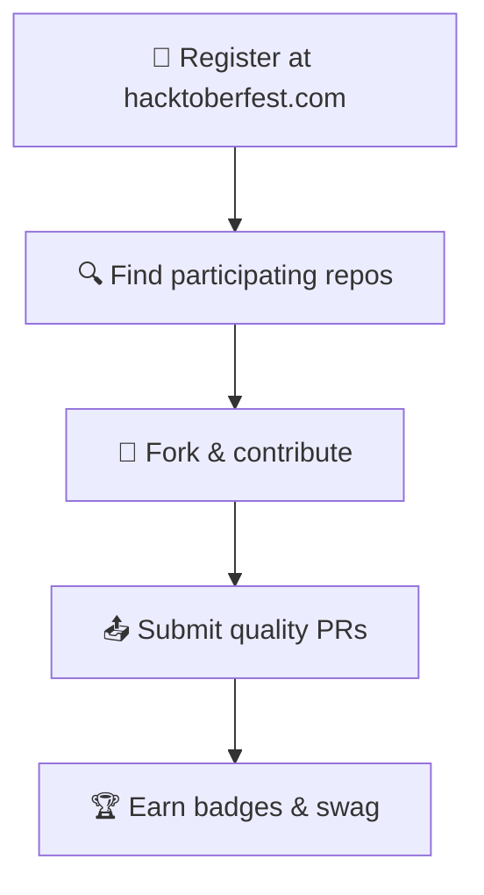

<div align="center">

# 🎃 Hacktoberfest × Holopin 🏆

### _Celebrate Open Source with Style_


<br>

[](https://hacktoberfest.com/)
[](https://holopin.io/)
[](https://opensource.org/)
[](https://choosealicense.com/licenses/mit/)
[](http://makeapullrequest.com)

<br>


</div>

<div align="center">

## 🌟 **Animated Showcase** 🌟


&nbsp;&nbsp;&nbsp;&nbsp;

&nbsp;&nbsp;&nbsp;&nbsp;


<br><br>

### 🚀 **Modern React + TypeScript + Vite Starter**

_Built for the open source community with love_ ❤️

</div>

---

<div align="center">

## 🎯 **What Makes This Special?**

<table>
<tr>
<td align="center" width="33%">

### ⚡ **Lightning Fast**

Built with Vite for instant hot reload and blazing fast builds

</td>
<td align="center" width="33%">

### 🎨 **Beautiful UI**

Modern design with shadcn/ui components and Tailwind CSS

</td>
<td align="center" width="33%">

### 🔒 **Type Safe**

Full TypeScript support for better developer experience

</td>
</tr>
</table>

</div>

<div align="center">


## ✨ **Features That Spark Joy** ✨

</div>

<div align="center">
<table>
<tr>
<td align="center" width="50%">

### 🛠️ **Developer Experience**

- ⚡ **Vite** - Lightning fast build tool
- 🔷 **TypeScript** - Type safety & IntelliSense
- 🔍 **ESLint** - Code linting and formatting
- 🎯 **Hot Reload** - Instant feedback loop
- 📦 **Auto Import** - Smart import suggestions

</td>
<td align="center" width="50%">

### 🎨 **Modern UI/UX**

- ⚛️ **React 18** - Latest features & concurrent rendering
- 🎨 **shadcn/ui** - Beautiful, accessible components
- 🎯 **Tailwind CSS** - Utility-first styling
- 📱 **Responsive Design** - Mobile-first approach
- 🌙 **Dark Mode** - Built-in theme switching

</td>
</tr>
</table>
</div>

<div align="center">

### 🌈 **Animation & Interactions**

_Smooth animations powered by Framer Motion_


</div>

<div align="center">


## 🛠️ **Tech Stack**


</div>

<div align="center">
<table>
<tr>
<td align="center" width="25%">

**Frontend**

- React 18
- TypeScript
- Vite

</td>
<td align="center" width="25%">

**Styling**

- Tailwind CSS
- shadcn/ui
- Framer Motion

</td>
<td align="center" width="25%">

**Tools**

- ESLint
- Prettier
- Lucide Icons

</td>
<td align="center" width="25%">

**State & Forms**

- React Query
- React Hook Form
- Zod Validation

</td>
</tr>
</table>
</div>

<div align="center">


## 🚀 **Quick Start Guide**

</div>

### 📋 **Prerequisites**

<div align="center">


</div>

### 🛠️ **Installation**

```bash
# 1️⃣ Clone the repository
git clone https://github.com/your-username/hacktoberfest-holopin-spark.git
cd hacktoberfest-holopin-spark

# 2️⃣ Install dependencies
npm install

# 3️⃣ Start the development server
npm run dev

# 4️⃣ Open your browser and navigate to
# 🌐 http://localhost:5173
```

<div align="center">

### 🎮 **Available Commands**

<table>
<tr>
<td align="center">

**Command**

</td>
<td align="center">

**Description**

</td>
<td align="center">

**Usage**

</td>
</tr>
<tr>
<td>

`npm run dev`

</td>
<td>

Start development server

</td>
<td>

🔥 Hot reload enabled

</td>
</tr>
<tr>
<td>

`npm run build`

</td>
<td>

Build for production

</td>
<td>

📦 Optimized bundle

</td>
</tr>
<tr>
<td>

`npm run preview`

</td>
<td>

Preview production build

</td>
<td>

👀 Test before deploy

</td>
</tr>
<tr>
<td>

`npm run lint`

</td>
<td>

Run ESLint

</td>
<td>

🔍 Code quality check

</td>
</tr>
</table>

</div>

<div align="center">


## 🤝 **Contributing to Open Source**

### _Join the Global Developer Community!_


</div>

<div align="center">

### 🎯 **Perfect For**

<table>
<tr>
<td align="center" width="25%">


**🎃 Hacktoberfest**
_Participants_

</td>
<td align="center" width="25%">


**🏆 Holopin**
_Badge Collectors_

</td>
<td align="center" width="25%">


**👨‍💻 Open Source**
_Enthusiasts_

</td>
<td align="center" width="25%">


**🌱 First-time**
_Contributors_

</td>
</tr>
</table>

</div>

---

### 🛠️ **How to Contribute**

<div align="center">



</div>

#### **Step-by-Step Guide:**

```bash
# 1️⃣ Fork the repository (click the Fork button above)

# 2️⃣ Clone your fork
git clone https://github.com/YOUR-USERNAME/hacktoberfest-holopin-spark.git

# 3️⃣ Create a feature branch
git checkout -b feature/amazing-feature

# 4️⃣ Make your changes and commit
git add .
git commit -m "✨ Add amazing feature"

# 5️⃣ Push to your branch
git push origin feature/amazing-feature

# 6️⃣ Open a Pull Request
```

<div align="center">

### 💡 **Contribution Ideas**

<table>
<tr>
<td align="center" width="33%">

### 🐛 **Bug Fixes**

- Fix reported issues
- Improve error handling
- Performance optimizations

</td>
<td align="center" width="33%">

### ✨ **New Features**

- Add new components
- Implement animations
- Create interactive elements

</td>
<td align="center" width="33%">

### 📚 **Documentation**

- Improve README
- Add code comments
- Create tutorials

</td>
</tr>
<tr>
<td align="center" width="33%">

### 🎨 **UI/UX**

- Enhance design
- Improve accessibility
- Mobile responsiveness

</td>
<td align="center" width="33%">

### 🧪 **Testing**

- Add unit tests
- Integration tests
- E2E testing

</td>
<td align="center" width="33%">

### 🌐 **Accessibility**

- ARIA labels
- Keyboard navigation
- Screen reader support

</td>
</tr>
</table>

</div>

<div align="center">


## 📁 **Project Structure**

</div>

```
📦 hacktoberfest-holopin-spark/
├── 📂 public/                    # Static assets
│   ├── 🖼️ favicon.ico           # App favicon
│   └── 🎨 hacktoberfest-logo.png # Branding assets
├── 📂 src/
│   ├── 📂 components/            # 🧩 Reusable UI components
│   │   ├── 🧭 Navbar.tsx        # Navigation component
│   │   ├── 👤 GitHubProfileSection.tsx # Profile display
│   │   └── 👥 Contributors.tsx   # Contributors showcase
│   ├── 📂 data/                 # 📊 Static data and configurations
│   │   └── 👥 contributors.ts   # Contributors information
│   ├── 📂 hooks/                # 🎣 Custom React hooks
│   ├── 📂 lib/                  # 🛠️ Utility functions
│   ├── 📂 assets/               # 🎨 Images, icons, fonts
│   ├── ⚛️ App.tsx              # Main application component
│   └── 🚀 main.tsx             # Application entry point
├── 📄 index.html                # HTML template
├── 📋 package.json              # Dependencies and scripts
├── ⚙️ vite.config.ts           # Vite configuration
├── 🎨 tailwind.config.js       # Tailwind CSS config
└── 📖 README.md                 # You are here! 👋
```

<div align="center">

### 🏗️ **Architecture Overview**



</div>

<div align="center">


## 🚀 **Deployment**

</div>

### 📦 **Build for Production**

```bash
# Create optimized production build
npm run build

# Preview the production build locally
npm run preview
```

<div align="center">

### 🌐 **Deploy to Popular Platforms**

<table>
<tr>
<td align="center" width="25%">


**Vercel**
_Automatic deployments_
[Deploy Now](https://vercel.com/new)

</td>
<td align="center" width="25%">


**Netlify**
_Drag & drop or Git_
[Deploy Now](https://netlify.com/drop)

</td>
<td align="center" width="25%">


**GitHub Pages**
_GitHub Actions_
[Setup Guide](https://pages.github.com/)

</td>
<td align="center" width="25%">


**Railway**
_Instant deployment_
[Deploy Now](https://railway.app/)

</td>
</tr>
</table>

</div>

### ⚡ **One-Click Deploy**

<div align="center">

[](https://vercel.com/new/clone?repository-url=https://github.com/your-username/hacktoberfest-holopin-spark)
[](https://app.netlify.com/start/deploy?repository=https://github.com/your-username/hacktoberfest-holopin-spark)

</div>

### 🔄 **CI/CD Workflow**

```yaml
# .github/workflows/deploy.yml
name: 🚀 Deploy to Production
on:
  push:
    branches: [main]
jobs:
  deploy:
    runs-on: ubuntu-latest
    steps:
      - uses: actions/checkout@v3
      - uses: actions/setup-node@v3
      - run: npm ci
      - run: npm run build
      - run: npm run deploy
```

<div align="center">


## 🎃 **Hacktoberfest 2025** 🎃

### _A Month-Long Celebration of Open Source_


</div>

<div align="center">

### 🌟 **What is Hacktoberfest?**

Hacktoberfest is a **month-long celebration** of open source software run by **DigitalOcean**.
Join thousands of developers worldwide in contributing to open source projects!

<table>
<tr>
<td align="center" width="25%">


**🚀 Register**
_Sign up at hacktoberfest.com_

</td>
<td align="center" width="25%">


**💻 Contribute**
_Make 4 quality PRs_

</td>
<td align="center" width="25%">


**🏆 Earn Badges**
_Get Holopin rewards_

</td>
<td align="center" width="25%">


**🎁 Get Swag**
_Receive exclusive items_

</td>
</tr>
</table>

</div>

### 📋 **Hacktoberfest Guidelines**

<div align="center">

| ✅ **DO**                       | ❌ **DON'T**                   |
| ------------------------------- | ------------------------------ |
| Make meaningful contributions   | Submit spam PRs                |
| Follow project guidelines       | Ignore code quality            |
| Be respectful and collaborative | Rush for quantity over quality |
| Test your changes               | Break existing functionality   |
| Write clear commit messages     | Use generic commit messages    |

</div>

<div align="center">

### 🎯 **How to Participate**



</div>

<div align="center">


## 🏆 **Holopin Digital Badges** 🏆

### _Collect, Display, and Celebrate Your Contributions!_


</div>

<div align="center">

### 🎖️ **Available Badges**

<table>
<tr>
<td align="center" width="20%">


**🥇 First Contribution**
_Make your first PR_

</td>
<td align="center" width="20%">


**🐛 Bug Hunter**
_Fix a reported issue_

</td>
<td align="center" width="20%">


**✨ Feature Creator**
_Add a new feature_

</td>
<td align="center" width="20%">


**📚 Documentation**
_Improve docs_

</td>
<td align="center" width="20%">


**🎨 Design Master**
_Enhance UI/UX_

</td>
</tr>
</table>

### 🌟 **Special Achievement Badges**

<table>
<tr>
<td align="center" width="25%">

**🔥 Streak Master**
_5+ consecutive contributions_

</td>
<td align="center" width="25%">

**🚀 Performance Guru**
_Optimize app performance_

</td>
<td align="center" width="25%">

**🧪 Testing Champion**
_Add comprehensive tests_

</td>
<td align="center" width="25%">

**🌐 Accessibility Hero**
_Improve accessibility_

</td>
</tr>
</table>

### 📊 **Your Holopin Board**

Display your badges proudly on your GitHub profile!

[](https://holopin.io/@yourusername)

</div>

<div align="center">


## � **\*Issues & Feature Requests**

### _Help Us Improve Together!_

</div>

<div align="center">

Found a bug or have a brilliant idea? We'd love to hear from you!

[](../../issues)
[](../../pulls)

</div>

<div align="center">

### 🎯 **Issue Types**

<table>
<tr>
<td align="center" width="25%">


**🐛 Bug Reports**
_Help us squash bugs_
[Report Bug](../../issues/new?template=bug_report.md)

</td>
<td align="center" width="25%">


**💡 Feature Requests**
_Suggest improvements_
[Request Feature](../../issues/new?template=feature_request.md)

</td>
<td align="center" width="25%">


**📖 Documentation**
_Improve our docs_
[Improve Docs](../../issues/new?template=documentation.md)

</td>
<td align="center" width="25%">


**❓ Questions**
_Get help & support_
[Ask Question](../../discussions)

</td>
</tr>
</table>

</div>

### 🏷️ **Issue Labels**

<div align="center">


</div>

<div align="center">


## 🔧 **Development Guidelines**

### _Code with Style and Purpose_

</div>

<div align="center">

### 📝 **Code Standards**

<table>
<tr>
<td align="center" width="33%">

### 🎯 **Code Style**

- ✅ Use TypeScript for type safety
- ✅ Follow ESLint rules
- ✅ Use Prettier for formatting
- ✅ Write meaningful commit messages

</td>
<td align="center" width="33%">

### 🧩 **Component Guidelines**

- ✅ Functional components with hooks
- ✅ Proper TypeScript interfaces
- ✅ Follow shadcn/ui patterns
- ✅ Ensure accessibility compliance

</td>
<td align="center" width="33%">

### 🧪 **Testing Standards**

- ✅ Unit tests for utilities
- ✅ Component functionality tests
- ✅ Responsive design validation
- ✅ Accessibility testing

</td>
</tr>
</table>

</div>

### 📋 **Commit Convention**

```bash
# Format: <type>(<scope>): <description>

✨ feat(auth): add user authentication
🐛 fix(ui): resolve mobile navigation issue
📚 docs(readme): update installation guide
🎨 style(components): improve button styling
♻️ refactor(utils): optimize helper functions
🧪 test(auth): add login component tests
```

<div align="center">

### 🔍 **Code Quality Tools**


</div>

<div align="center">


## � *c*Connect With Me\*\*

### _Let's Build Amazing Things Together!_

<a href="https://github.com/your-username">
  
</a>
<a href="https://linkedin.com/in/your-username">
  
</a>
<a href="https://twitter.com/your-username">
  
</a>
<a href="mailto:your-email@example.com">
  
</a>

### 🌟 **Show Your Support**

If this project helped you, please consider:

<a href="https://github.com/your-username/hacktoberfest-holopin-spark">
  
</a>
<a href="https://github.com/your-username/hacktoberfest-holopin-spark/fork">
  
</a>

</div>

---

<div align="center">

## 📄 **License**

This project is licensed under the **MIT License** - see the [LICENSE](LICENSE) file for details.


</div>

---

<div align="center">

## 🙏 **Acknowledgments**

### _Standing on the Shoulders of Giants_

<table>
<tr>
<td align="center" width="20%">


**[shadcn/ui](https://ui.shadcn.com/)**
_Beautiful components_

</td>
<td align="center" width="20%">


**[Radix UI](https://www.radix-ui.com/)**
_Accessible primitives_

</td>
<td align="center" width="20%">


**[Tailwind CSS](https://tailwindcss.com/)**
_Utility-first styling_

</td>
<td align="center" width="20%">


**[Vite](https://vitejs.dev/)**
_Lightning fast builds_

</td>
<td align="center" width="20%">


**[React](https://react.dev/)**
_UI library_

</td>
</tr>
</table>

### 🎉 **Special Thanks**


_All our amazing contributors who make this project possible!_

</div>

---

<div align="center">

## 📞 **Support & Help**

<table>
<tr>
<td align="center" width="33%">


**📧 Email Support**
[Create an Issue](../../issues/new)

</td>
<td align="center" width="33%">


**💬 Discussions**
[GitHub Discussions](../../discussions)

</td>
<td align="center" width="33%">


**📖 Documentation**
[Read the Docs](../../wiki)

</td>
</tr>
</table>

</div>

---

<div align="center">


### **Happy Coding! 🚀**


<br>

[](https://hacktoberfest.com/)
[](https://holopin.io/)

</div>
